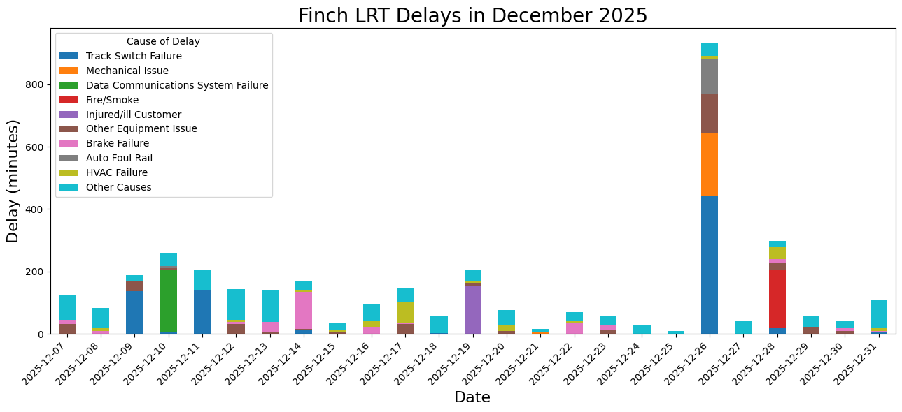

# Data Visualization

Analyzed dataset: 02_activities\assignments\assignment_3\TTC LRT Delays.csv

[Plot code](assignment_3.ipynb)

For each visualization, describe and justify: 

---

What software did you use to create your data visualization?

> Python, using `numpy`, `matplotlib`, and `pandas`.

Who is your intended audience? 

> TTC engineers, or curious members of the public.
    
What information or message are you trying to convey with your visualization? 

> The first two weeks of the Finch FRT's operation saw frequent delays, with total delays often amounting to over 2 hours per day. The second two weeks saw fewer delays, with the exception of Boxing Day during which the LRT was delayed for over 15.5 hours. Incidentally, there was significant snowfall throughout that day (not represented here). The reasons for the delay are also shown in each bar's levels; if a specific reason caused a delay for more than 60 minutes on any given day it is represented by a colour, otherless it is shown as "Other". The longest delays in December 2025 were caused by track switch failure, mechanical issues, and data communications system failure.
    
What aspects of design did you consider when making your visualization? How did you apply them? With what elements of your plots? 

> A stacked barplot makes good use of the Continuity principle, as individual levels of a bar appear to (and do) form a larger group. Here I was trying to represent the individual effects of each cause of delay, as well as their cumulative total delay for each given day.
    
How did you ensure that your data visualizations are reproducible? If the tool you used to make your data visualization is not reproducible, how will this impact your data visualization? 

> All code used for this visualization is contained in the relevant Jupyter notebook, and is commented to explain each step of the script.
    
How did you ensure that your data visualization is accessible?  

> In the dataset, 55 delay codes were listed. To cut down on visual noise, I only represented the delay reasons that caused delays of over 60 minutes on any given day and condensed the other reasons into an "Other" group". I also used contrasting colour hues to distinguish the groups within each bar and enlarged text in some places.
    
Who are the individuals and communities who might be impacted by your visualization?  

> TTC engineers who are trying to address TTC delays would benefit by understanding the causes behind major and minor delays on the Finch LRT, and could further connect this visualization to additional data on daily ridership, weather records, etc. As the TTC is a public entity that is used by Torontonians en masse, members of the public would also be interested in the function of the new LRT, which could inform their transit preferences along the LRT route.
    
How did you choose which features of your chosen dataset to include or exclude from your visualization? 

> I plotted both Delay Time and Cause of Delay to show richer data than can be shown in a simple barplot. Including the date on the x-axis also made for an interesting timeline. As previously mentioned, I excluded several Causes of Delay in order to lessen the cognitive load of the plot.
    
What ‘underwater labour’ contributed to your final data visualization product?

> I created a dictionary of delay codes and code descriptions, taken from a supplementary dataset [TTC Delay code descriptions](<Code Descriptions.csv>) as the codes themselves were not useful to plot. Data cleaning was also involved to create the "Other" group.